<div align="center">


<br/>

<!-- 3D ARIA Logo — radial depth + glow rings -->
<svg width="160" height="160" viewBox="0 0 160 160" xmlns="http://www.w3.org/2000/svg">
  <defs>
    <radialGradient id="orb" cx="38%" cy="32%" r="65%">
      <stop offset="0%"   stop-color="#00e5ff" stop-opacity="1"/>
      <stop offset="45%"  stop-color="#0077ff" stop-opacity="1"/>
      <stop offset="100%" stop-color="#000d1a" stop-opacity="1"/>
    </radialGradient>
    <radialGradient id="ring1" cx="50%" cy="50%" r="50%">
      <stop offset="70%"  stop-color="#00e5ff" stop-opacity="0"/>
      <stop offset="100%" stop-color="#00e5ff" stop-opacity="0.35"/>
    </radialGradient>
    <radialGradient id="ring2" cx="50%" cy="50%" r="50%">
      <stop offset="70%"  stop-color="#0044ff" stop-opacity="0"/>
      <stop offset="100%" stop-color="#0044ff" stop-opacity="0.18"/>
    </radialGradient>
    <filter id="glow">
      <feGaussianBlur stdDeviation="3.5" result="blur"/>
      <feMerge><feMergeNode in="blur"/><feMergeNode in="SourceGraphic"/></feMerge>
    </filter>
    <filter id="shadow">
      <feDropShadow dx="0" dy="8" stdDeviation="12" flood-color="#00e5ff" flood-opacity="0.4"/>
    </filter>
  </defs>
  <!-- outer glow rings -->
  <circle cx="80" cy="80" r="78" fill="url(#ring2)"/>
  <circle cx="80" cy="80" r="64" fill="url(#ring1)"/>
  <!-- main orb -->
  <circle cx="80" cy="80" r="52" fill="url(#orb)" filter="url(#shadow)"/>
  <!-- specular highlight -->
  <ellipse cx="64" cy="60" rx="14" ry="9" fill="white" opacity="0.18"/>
  <!-- ARIA text -->
  <text x="80" y="87" text-anchor="middle" font-family="JetBrains Mono, monospace" font-weight="700"
        font-size="22" fill="#00e5ff" filter="url(#glow)" letter-spacing="3">ARIA</text>
  <!-- circuit lines -->
  <line x1="80" y1="132" x2="80" y2="148" stroke="#00e5ff" stroke-width="1.5" opacity="0.6"/>
  <line x1="68" y1="142" x2="92" y2="142" stroke="#00e5ff" stroke-width="1.5" opacity="0.6"/>
  <circle cx="68" cy="142" r="2" fill="#00e5ff" opacity="0.8"/>
  <circle cx="92" cy="142" r="2" fill="#00e5ff" opacity="0.8"/>
</svg>

<br/>

# ARIA — Advanced Responsive Intelligence Assistant

**Full-stack AI smart home system. Holographic pixel-art face, PBR 3D living room,**  
**live weather, real-time news, voice control, Mistral AI reasoning engine.**

<br/>

<!-- Tech stack badges -->


<br/><br/>


<br/>

<!-- Live links -->
[](https://aria-smart-home-system.vercel.app/)
[](https://ragas111-aria-smarthome-backned.hf.space/api/health)

</div>

---

## Table of Contents

- [System Architecture](#system-architecture)
- [Tech Stack](#tech-stack)
- [Features](#features)
- [Data Flow — WebSocket Protocol](#data-flow--websocket-protocol)
- [Agent Reasoning Loop](#agent-reasoning-loop)
- [Smart Home Tool Matrix](#smart-home-tool-matrix)
- [Emotion System](#emotion-system)
- [Three.js Room Layout](#threejs-room-layout)
- [API Reference](#api-reference)
- [Quality Test Analytics](#quality-test-analytics)
- [Deployment Architecture](#deployment-architecture)
- [File Structure](#file-structure)
- [Environment Setup](#environment-setup)

---

## System Architecture

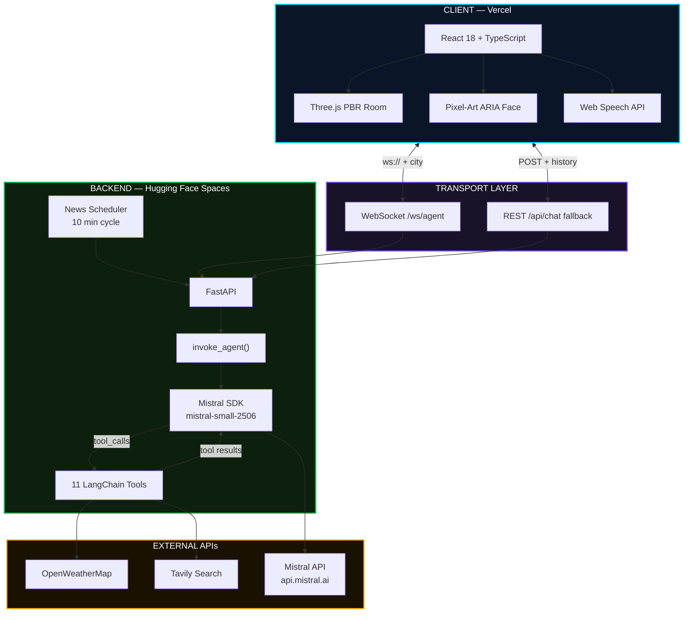

---

## Tech Stack

<div align="center">

<!-- Row 1: Backend icons -->
<svg width="760" height="90" viewBox="0 0 760 90" xmlns="http://www.w3.org/2000/svg">
  <defs>
    <linearGradient id="cardBg" x1="0%" y1="0%" x2="0%" y2="100%">
      <stop offset="0%" stop-color="#141e2e"/>
      <stop offset="100%" stop-color="#0a1020"/>
    </linearGradient>
    <linearGradient id="teal3d" x1="0%" y1="0%" x2="0%" y2="100%">
      <stop offset="0%" stop-color="#26d7c0"/>
      <stop offset="100%" stop-color="#009688"/>
    </linearGradient>
    <linearGradient id="blue3d" x1="0%" y1="0%" x2="0%" y2="100%">
      <stop offset="0%" stop-color="#64b5f6"/>
      <stop offset="100%" stop-color="#1565c0"/>
    </linearGradient>
    <linearGradient id="orange3d" x1="0%" y1="0%" x2="0%" y2="100%">
      <stop offset="0%" stop-color="#ffb74d"/>
      <stop offset="100%" stop-color="#e65100"/>
    </linearGradient>
    <linearGradient id="purple3d" x1="0%" y1="0%" x2="0%" y2="100%">
      <stop offset="0%" stop-color="#b39ddb"/>
      <stop offset="100%" stop-color="#4527a0"/>
    </linearGradient>
    <linearGradient id="green3d" x1="0%" y1="0%" x2="0%" y2="100%">
      <stop offset="0%" stop-color="#81c784"/>
      <stop offset="100%" stop-color="#1b5e20"/>
    </linearGradient>
    <filter id="card-shadow">
      <feDropShadow dx="0" dy="4" stdDeviation="6" flood-color="#000" flood-opacity="0.5"/>
    </filter>
  </defs>

  <!-- FastAPI -->
  <rect x="4" y="8" width="130" height="74" rx="10" fill="url(#cardBg)" filter="url(#card-shadow)" stroke="#009688" stroke-width="1"/>
  <circle cx="34" cy="35" r="14" fill="url(#teal3d)"/>
  <text x="34" y="40" text-anchor="middle" font-family="monospace" font-size="11" font-weight="bold" fill="white">FA</text>
  <text x="69" y="33" font-family="monospace" font-size="11" font-weight="700" fill="#26d7c0">FastAPI</text>
  <text x="69" y="48" font-family="monospace" font-size="9" fill="#546e7a">0.111.0</text>
  <text x="69" y="63" font-family="monospace" font-size="8" fill="#37474f">Python 3.11</text>

  <!-- Mistral -->
  <rect x="144" y="8" width="130" height="74" rx="10" fill="url(#cardBg)" filter="url(#card-shadow)" stroke="#ff7000" stroke-width="1"/>
  <circle cx="174" cy="35" r="14" fill="url(#orange3d)"/>
  <text x="174" y="40" text-anchor="middle" font-family="monospace" font-size="10" font-weight="bold" fill="white">MIS</text>
  <text x="208" y="33" font-family="monospace" font-size="11" font-weight="700" fill="#ffb74d">Mistral AI</text>
  <text x="208" y="48" font-family="monospace" font-size="9" fill="#546e7a">small-2506</text>
  <text x="208" y="63" font-family="monospace" font-size="8" fill="#37474f">Native SDK</text>

  <!-- LangChain -->
  <rect x="284" y="8" width="130" height="74" rx="10" fill="url(#cardBg)" filter="url(#card-shadow)" stroke="#4527a0" stroke-width="1"/>
  <circle cx="314" cy="35" r="14" fill="url(#purple3d)"/>
  <text x="314" y="40" text-anchor="middle" font-family="monospace" font-size="10" font-weight="bold" fill="white">LC</text>
  <text x="348" y="33" font-family="monospace" font-size="11" font-weight="700" fill="#b39ddb">LangChain</text>
  <text x="348" y="48" font-family="monospace" font-size="9" fill="#546e7a">0.2.1</text>
  <text x="348" y="63" font-family="monospace" font-size="8" fill="#37474f">@tool decorators</text>

  <!-- Tavily -->
  <rect x="424" y="8" width="130" height="74" rx="10" fill="url(#cardBg)" filter="url(#card-shadow)" stroke="#1565c0" stroke-width="1"/>
  <circle cx="454" cy="35" r="14" fill="url(#blue3d)"/>
  <text x="454" y="40" text-anchor="middle" font-family="monospace" font-size="10" font-weight="bold" fill="white">TV</text>
  <text x="488" y="33" font-family="monospace" font-size="11" font-weight="700" fill="#64b5f6">Tavily</text>
  <text x="488" y="48" font-family="monospace" font-size="9" fill="#546e7a">Search API</text>
  <text x="488" y="63" font-family="monospace" font-size="8" fill="#37474f">News + Web</text>

  <!-- OpenWeather -->
  <rect x="564" y="8" width="182" height="74" rx="10" fill="url(#cardBg)" filter="url(#card-shadow)" stroke="#1b5e20" stroke-width="1"/>
  <circle cx="594" cy="35" r="14" fill="url(#green3d)"/>
  <text x="594" y="40" text-anchor="middle" font-family="monospace" font-size="9" font-weight="bold" fill="white">OWM</text>
  <text x="618" y="33" font-family="monospace" font-size="11" font-weight="700" fill="#81c784">OpenWeather</text>
  <text x="618" y="48" font-family="monospace" font-size="9" fill="#546e7a">Map API v2.5</text>
  <text x="618" y="63" font-family="monospace" font-size="8" fill="#37474f">Real-time weather</text>
</svg>

</div>

| Layer | Technology | Purpose |
|---|---|---|
| **AI Engine** | Mistral `mistral-small-2506` — native SDK | Reasoning, tool selection, emotion tagging |
| **Backend** | FastAPI + Uvicorn | REST + WebSocket server |
| **Tools** | LangChain `@tool` decorators | Smart home + info tool definitions |
| **Frontend** | React 18 + TypeScript + Vite | SPA with hooks-based architecture |
| **3D Renderer** | Three.js — PBR materials, PCFSoftShadows | Immersive living room scene |
| **Animation** | Framer Motion | Page transitions, chat UI |
| **Voice** | Web Speech API | STT input, single-utterance mode |
| **Search** | Tavily AI Search | News headlines, topic search |
| **Weather** | OpenWeatherMap v2.5 | Real-time conditions + icons |
| **Geolocation** | Nominatim (OpenStreetMap) | Reverse geocode lat/lng to city |
| **Deploy: API** | Hugging Face Spaces — Docker SDK | Port 7860, Python 3.11-slim |
| **Deploy: UI** | Vercel — Vite framework | SPA rewrites, edge CDN |

---

## Features

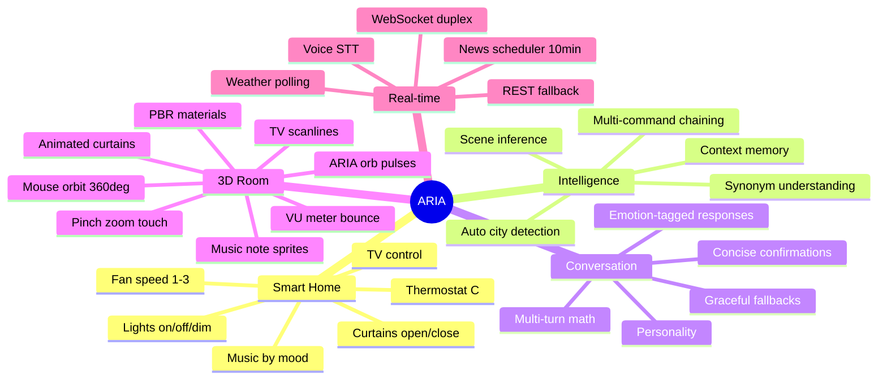

---

## Data Flow — WebSocket Protocol

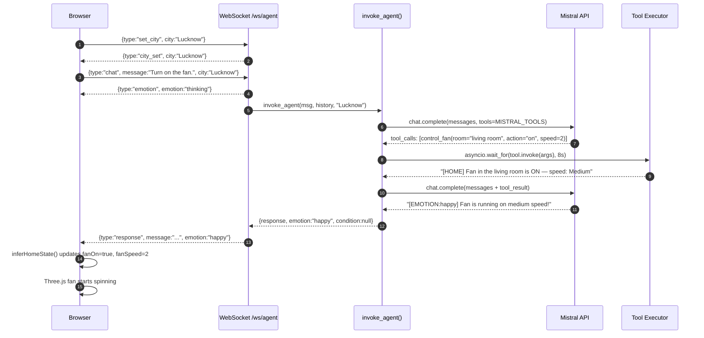

---

## Agent Reasoning Loop

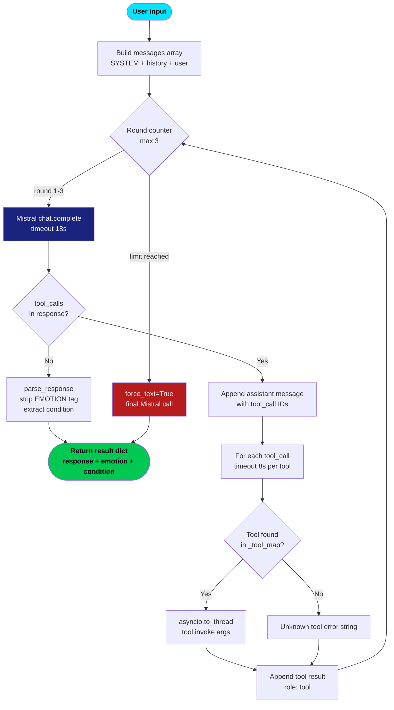

---

## Smart Home Tool Matrix

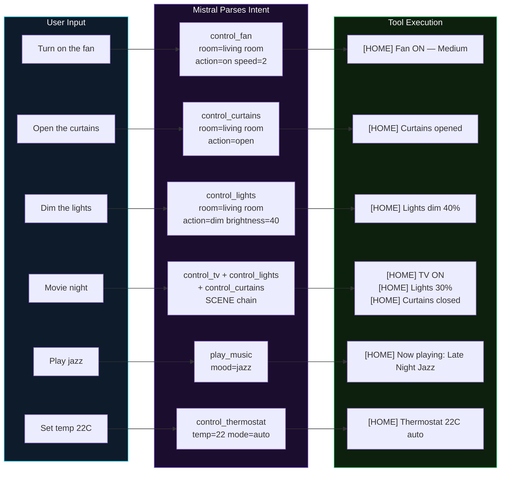

### All 11 Tools

| Tool | Parameters | Default |
|---|---|---|
| `get_weather` | `city: str` | uses detected city |
| `get_current_time` | — | system clock |
| `get_latest_news` | `topic: str = "world"` | world headlines |
| `set_timer` | `label: str, minutes: int` | — |
| `tell_joke` | — | random tech joke |
| `control_lights` | `room, action, brightness=100` | living room |
| `control_curtains` | `room, action` | living room |
| `control_fan` | `room, action, speed=2` | living room, medium |
| `control_thermostat` | `temperature, mode="auto"` | auto mode |
| `play_music` | `mood="chill"` | lo-fi chill |
| `control_tv` | `action, channel=None` | — |

---

## Emotion System

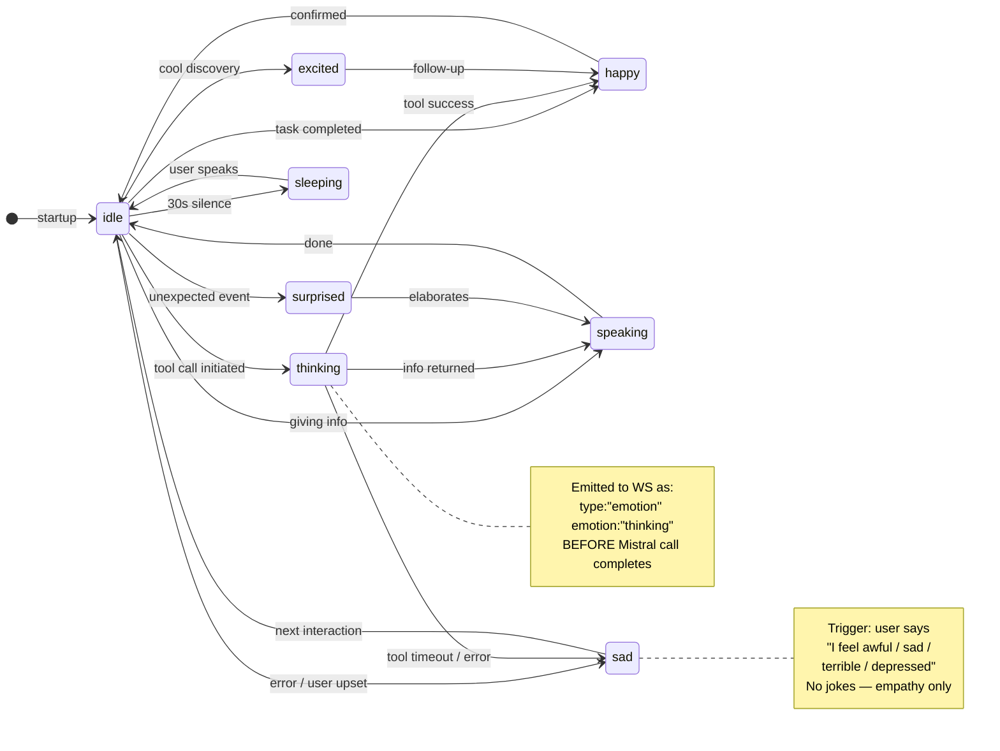

**Format in every Mistral response:**

```
[EMOTION:happy] Fan is running at medium speed!
  ^─ canonical tag stripped by parse_response()
```

`parse_response()` handles: `[EMOTION:happy]` / `[EMOTION: happy]` / `[happy]` shorthand — all normalised to the same output dict.

---

## Three.js Room Layout

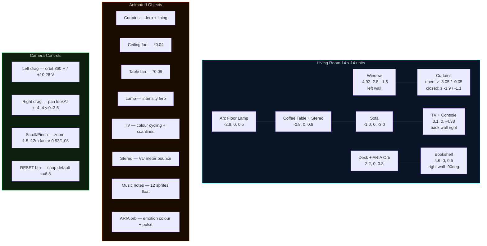

**Renderer config:** `ACESFilmicToneMapping` — `PCFSoftShadowMap` — `exposure=0.95` — `FOV=62°`

---

## API Reference

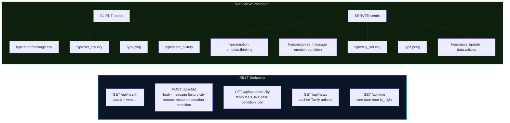

---

## Quality Test Analytics

**40 test cases across 6 categories — run via `python test_aria_quality.py`**

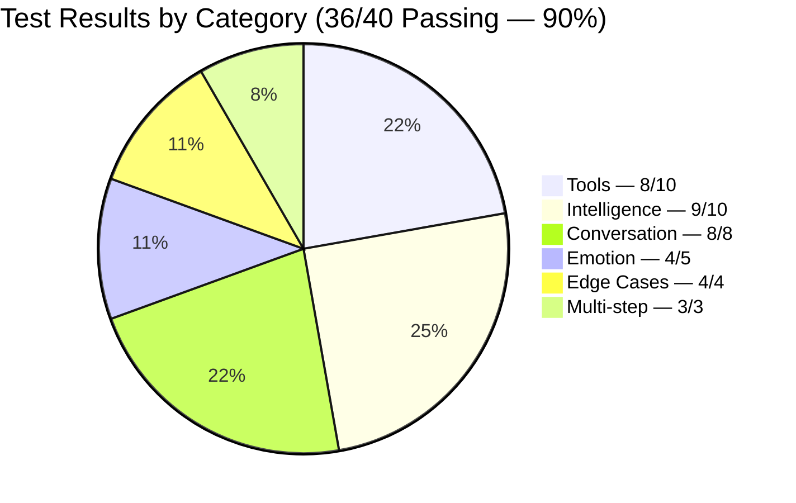

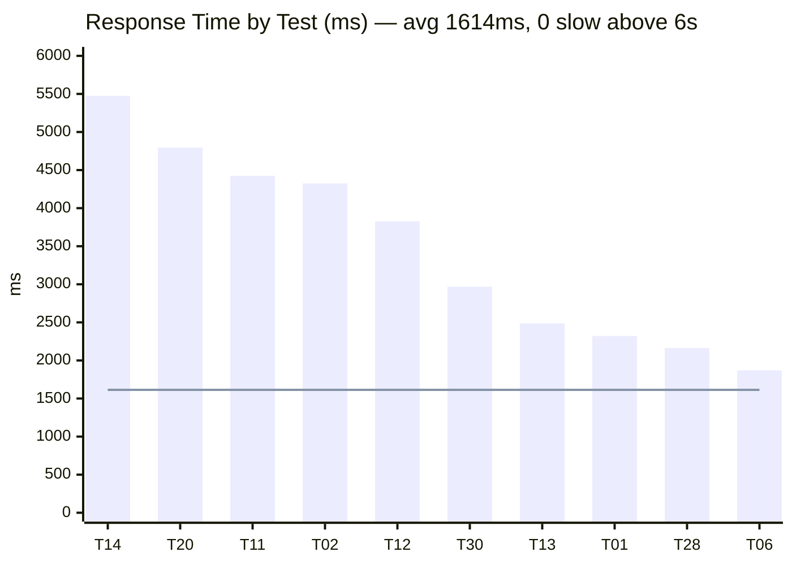

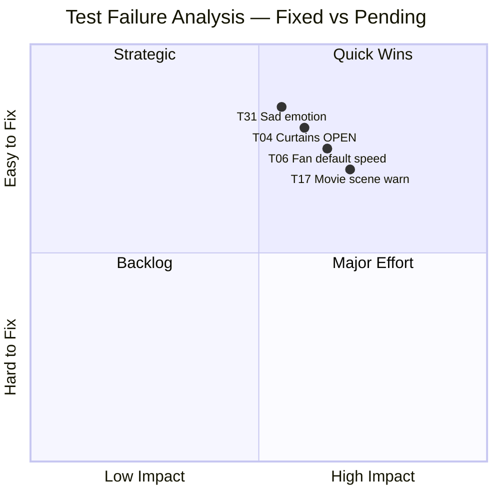

**Resolved failures** — SYSTEM_PROMPT patches in `main.py`:

| Test | Input | Before | After |
|---|---|---|---|
| [04] | "Open the curtains." | Fan suggestion instead | `control_curtains("open")` fires immediately |
| [06] | "Turn on the fan." | Weather commentary | `control_fan("on", 2)` fires immediately |
| [31] | "I feel really awful today." | Joke + `happy` emotion | Empathy + `sad` emotion |
| [17] | "Set up a movie night." | 1 device only | TV + dim lights + curtains chained |

---

## Deployment Architecture

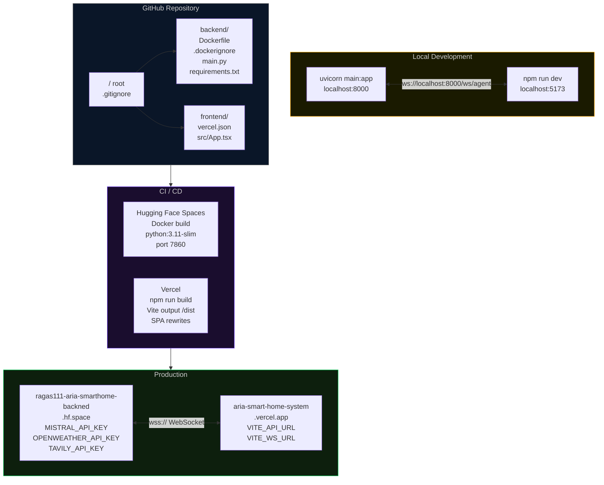

---

## File Structure

```
ARIA/
├── .gitignore                     # root — covers backend + frontend
│
├── backend/                       # Hugging Face Spaces repo root
│   ├── Dockerfile                 # python:3.11-slim, port 7860
│   ├── .dockerignore              # excludes tests, htmlcov, venv
│   ├── README.md                  # HF Spaces YAML frontmatter
│   ├── requirements.txt           # production deps only
│   ├── requirements-test.txt      # pytest, ruff, mypy, coverage
│   ├── .env                       # secrets — never committed
│   ├── .env.example               # template — safe to commit
│   │
│   ├── main.py                    # FastAPI app — 620 lines
│   │   ├── 11 LangChain @tools
│   │   ├── SYSTEM_PROMPT          # emotion + device rules
│   │   ├── parse_response()       # strips EMOTION tags
│   │   ├── _sanitize_history()    # alternating roles, 8-msg cap
│   │   ├── invoke_agent()         # Mistral loop, 3 rounds max
│   │   ├── news_scheduler()       # Tavily every 10 min
│   │   └── WebSocket /ws/agent    # full-duplex with city support
│   │
│   ├── test_aria_quality.py       # 40 quality test cases
│   ├── test_backend.py            # 107 assertions
│   └── debug_aria.py              # deep diagnostic tool
│
└── frontend/                      # Vercel repo root
    ├── vercel.json                # SPA rewrites + security headers
    ├── .env.production            # VITE_API_URL → hf.space
    ├── .env.development           # localhost:8000
    ├── .env.example               # template
    │
    ├── src/
    │   └── App.tsx                # entire frontend — 2639 lines
    │       ├── LoadingScreen      # boot log, sessionStorage skip
    │       ├── HomePage           # ARIA face + feature badges
    │       ├── RoomPage           # 68% Three.js + 32% UI
    │       ├── AboutPage          # tech stack
    │       ├── useAgent()         # WS + REST hook, auto-reconnect
    │       ├── useWeather()       # 10 min polling
    │       ├── inferHomeState()   # regex → device state sync
    │       └── Three.js PBR Room  # full scene with all animations
    │
    ├── index.html
    ├── package.json
    ├── tsconfig.json
    └── vite.config.ts
```

---

## Environment Setup

### Backend — local

```bash
cd backend
python -m venv Aria-backend
source Aria-backend/bin/activate        # Windows: Aria-backend\Scripts\activate
pip install -r requirements-test.txt

# create .env from template
cp .env.example .env
# fill in MISTRAL_API_KEY, OPENWEATHER_API_KEY, TAVILY_API_KEY

uvicorn main:app --reload --port 8000
```

### Frontend — local

```bash
cd frontend
npm install
cp .env.example .env.development        # already points to localhost:8000
npm run dev
```

### Run quality tests

```bash
cd backend
python test_aria_quality.py              # all 40 cases
python test_aria_quality.py --cat tools  # category filter
python test_aria_quality.py --only 31    # single test
python test_aria_quality.py --verbose --save report.json
```

### Docker — local preview

```bash
cd backend
docker build -t aria-backend .
docker run -p 7860:7860 \
  -e MISTRAL_API_KEY=... \
  -e OPENWEATHER_API_KEY=... \
  -e TAVILY_API_KEY=... \
  aria-backend
```

---

## Known Issues / Roadmap

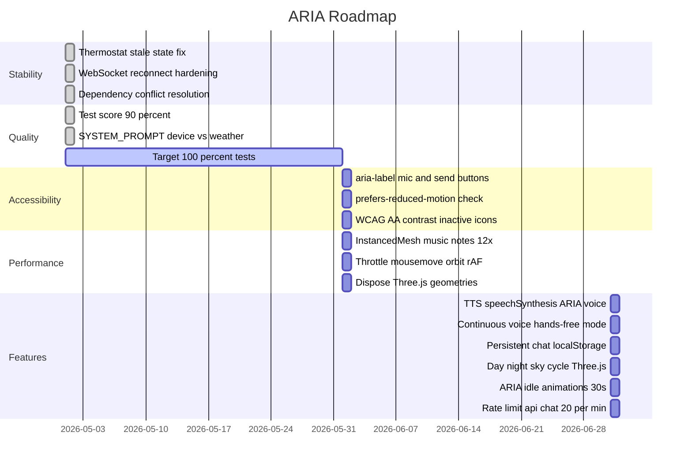

---

<div align="center">


<br/>

[](https://aria-smart-home-system.vercel.app/)

</div>
